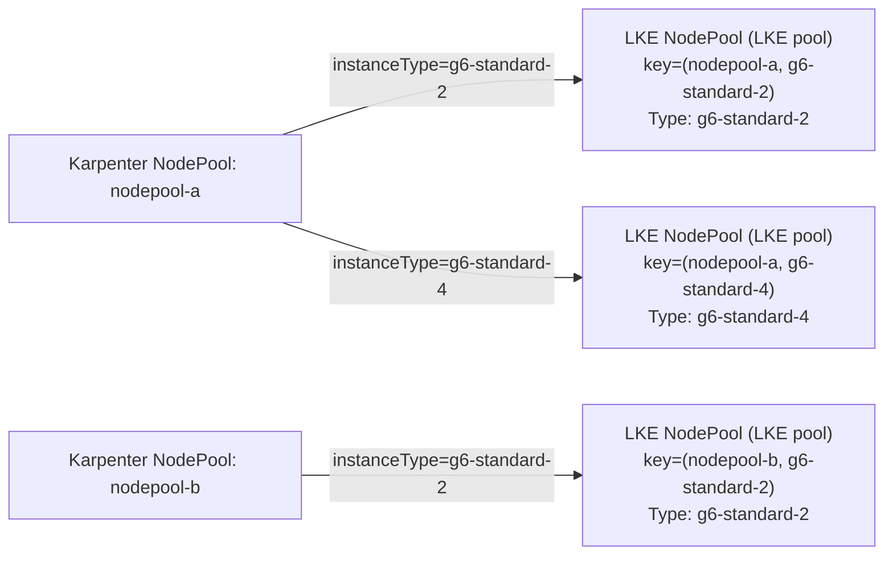
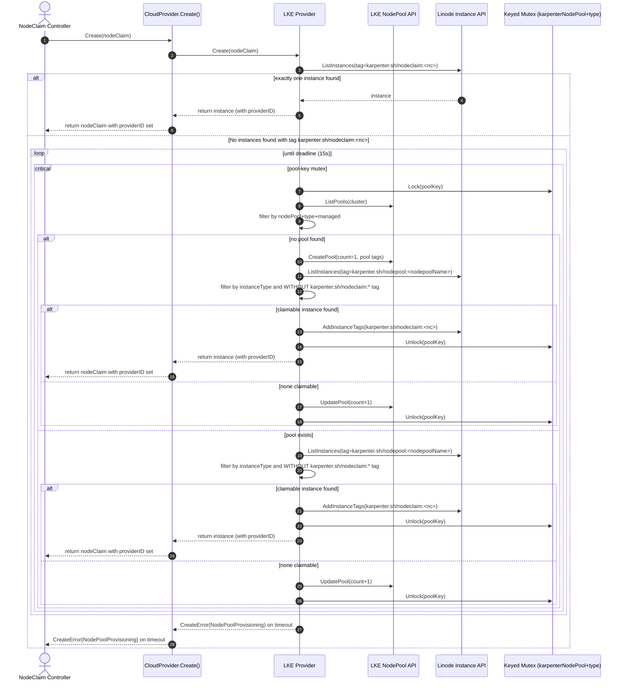

# LKE multi-node NodePool scale-up (Draft)

This document summarizes the core assumptions, invariants, and high-level flow for scaling existing LKE node pools in LKE mode, optimized for fast review and feedback.

## Goals
- Maintain a strict 1:1 mapping between a Karpenter `NodeClaim` and a Linode VM.
- Set `nodeClaim.status.providerID` during `CloudProvider.Create()`.
- Support many concurrent `Create()` calls without double-claiming a VM or racing pool mutations.

## Terminology
- `NodePool` (Karpenter): Kubernetes resource `karpenter.sh/NodePool`.
- `NodePool` (LKE): Linode LKE node pool (`linodego.LKENodePool`).
- `NodeClaim`: Kubernetes resource `karpenter.sh/NodeClaim`.
- `Instance`: Linode VM (`linodego.Instance`), identified by `instanceID`.

## Core model and invariants
- **Pool mapping:** exactly 1 LKE pool per `(Karpenter NodePool name, instanceType)`.
- **Pool discovery:** always list pools and filter client-side (server-side tag filtering is unreliable for LKE pools).
- **Determinism:** if multiple claimable instances exist, claim the first `instanceID` in the list.
- **Tag ownership:**
  - `karpenter.sh/nodeclaim:<nodeClaimName>` is **instance-scoped only**.
  - `karpenter.sh/nodeclaim` is the authoritative orchestration signal for claim ownership: instances without any `karpenter.sh/nodeclaim:*` tag are treated as unclaimed and can only be claimed by writing `karpenter.sh/nodeclaim:<nodeClaimName>`.
  - Pool-scoped tags may be written via LKE pool APIs.

### Pool mapping diagram

## Tier-specific assumptions
- **Enterprise tier**
  - LKE pool tags propagate to underlying Linode instance tags.
  - LKE node pool `Linodes` information can be delayed; enumerate membership via the Linode Instance API using the Karpenter NodePool tag and client-side filtering by `instanceType`.
- **Standard tier**
  - LKE pool tags do not propagate to instances.
  - Required identity tags are applied directly to the instance at claim time.

## Concurrency model
- Assume a single active writer (leader election).
- Use an in-process keyed mutex keyed by `(karpenterNodePoolName, instanceType)`.
- The mutex protects:
  - pool lookup/create
  - pool `count` mutations
  - candidate selection and instance claiming (`karpenter.sh/nodeclaim:<name>`)
  - node-level delete + orphan GC mutations for that pool key

## High-level `Create()` flow
Inputs:
- `karpenterNodePoolName := nodeClaim.labels[karpenter.sh/nodepool]`
- `instanceType := resolved single instance type`
- `poolKey := (karpenterNodePoolName, instanceType)`

### Step 1: Fast idempotency
- Query instances by tag `karpenter.sh/nodeclaim:<nodeClaimName>`.
- If exactly one instance exists, return it (covers status update failure after instance tag write).

### Step 2: Claim-or-scale loop (bounded by 15s)
Repeat until deadline:
- Lock mutex for `poolKey`.
- Find or create the LKE pool for `(nodepoolName, instanceType)`.
- Determine claimable instances:
  - **Standard:** pool membership from `GetLKENodePool(poolID).Linodes`.
    - If we just scaled (or observe in-flight nodes), wait/poll until the new node has a non-zero `InstanceID` (typically ~2–3 seconds) before treating it as claimable.
    - Ignore nodes with `InstanceID == 0`.
  - **Enterprise:** pool membership from Instance API filtered by:
    - `karpenter.sh/nodepool:<nodepoolName>`, then client-side filter by `instanceType`.
- Claimability gate: only consider instances that do not already have any `karpenter.sh/nodeclaim:*` tag.
- If a claimable instance exists:
  - Write `karpenter.sh/nodeclaim:<nodeClaimName>` to the instance.
  - (Standard) also write required identity tags to the instance.
  - Unlock mutex and return providerID.
- If no claimable instance exists:
  - scale the pool by incrementing `pool.Count`.
- Unlock.
- Retry until deadline (no sleep).

On timeout: return a retryable `CreateError` (reason `NodePoolProvisioning`) so Karpenter requeues.

### Enterprise `Create()` sequence diagram

## Error policy (review focus)
- **Retryable** (`CreateError` / `NodePoolProvisioning`):
  - timeouts waiting for claimable instance (bounded by 15s)
  - eventual consistency delays
  - retryable API errors (429/5xx)
- **Invariant violations (hard errors):**
  - >1 pool matches `(karpenterNodePoolName, instanceType)`
  - >1 instance matches `karpenter.sh/nodeclaim:<nodeClaimName>`
  - any instance has multiple `karpenter.sh/nodeclaim:*` tags

## Delete + orphan capacity (summary)
- Delete must be node-level (delete node from pool), deleting the pool only when removing the last node.
- Orphan capacity can occur if scaling succeeds but claiming fails; orphan GC will remove unclaimed capacity after a fixed TTL (5m).

## Open questions for review
- Is 15s a reasonable upper bound in `Create()` before returning a retryable error?
- Are the invariants and “hard error” cases correct, or should any be relaxed/strengthened?
- Is the orphan TTL (5m) the right tradeoff for cost vs safety?
