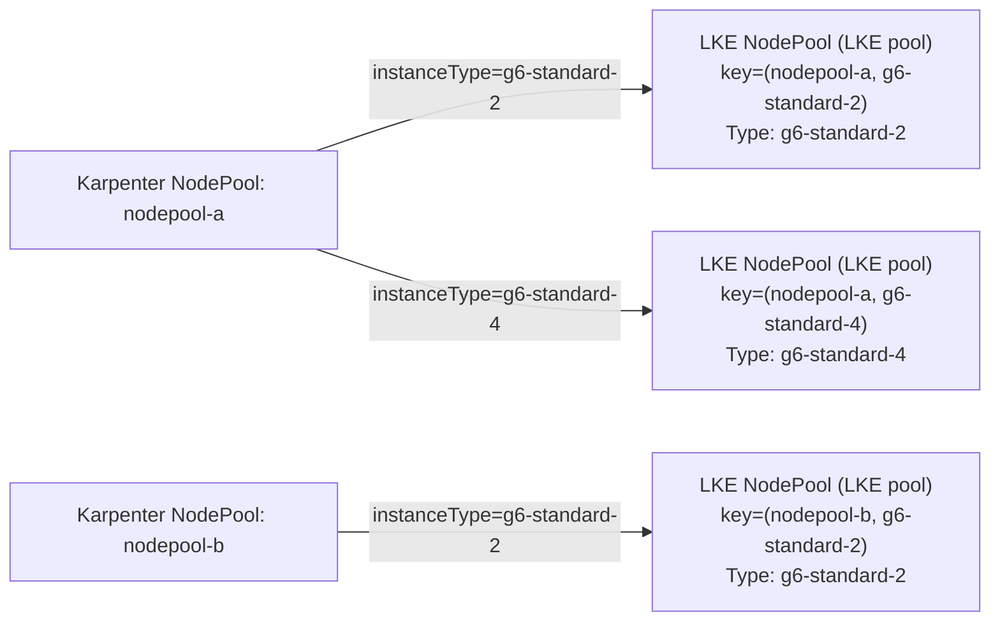
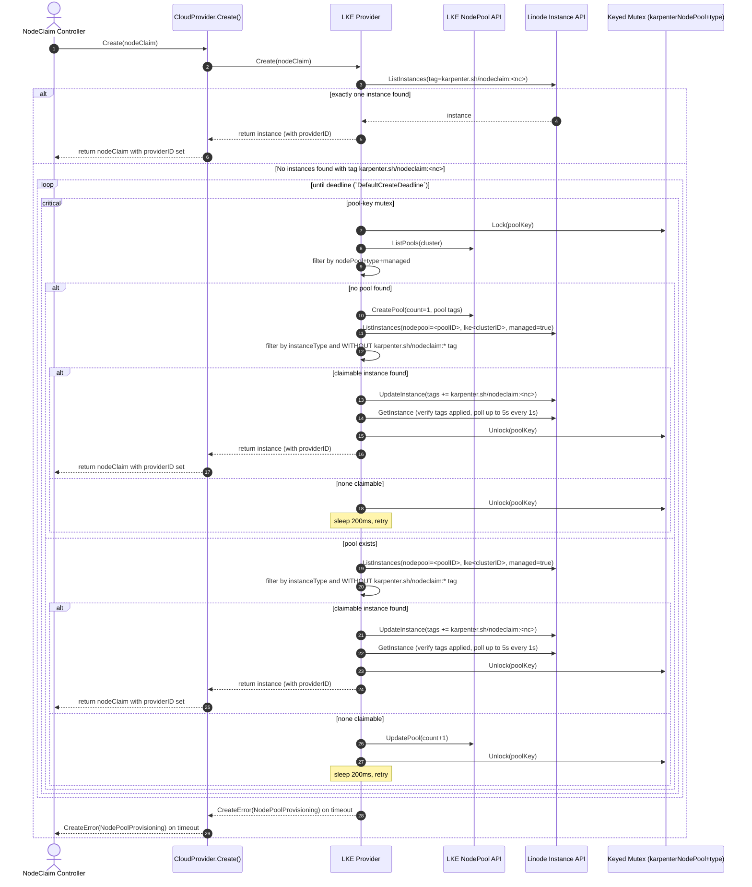

# LKE multi-node NodePool scale-up (Draft)

This document summarizes the core assumptions, invariants, and high-level flow for scaling existing LKE node pools in LKE mode, optimized for fast review and feedback.

## Goals
- Maintain a strict 1:1 mapping between a Karpenter `NodeClaim` and a Linode VM.
- Set `nodeClaim.status.providerID` during `CloudProvider.Create()`.
- Support many concurrent `Create()` calls without double-claiming a VM or racing pool mutations.

## Terminology
- `NodePool` (Karpenter): Kubernetes resource `karpenter.sh/NodePool`.
- `NodePool` (LKE): Linode LKE node pool (`linodego.LKENodePool`).
- `NodeClaim`: Kubernetes resource `karpenter.sh/NodeClaim`.
- `Instance`: Linode VM (`linodego.Instance`), identified by `instanceID`.

## Core model and invariants
- **Pool mapping:** exactly 1 LKE pool per `(Karpenter NodePool name, instanceType)`.
- **Pool discovery:** always list pools and filter client-side (server-side tag filtering is unreliable for LKE pools).
- **Determinism:** if multiple claimable instances exist, claim the first `instanceID` in the list.
- **Tag ownership:**
  - `karpenter.sh/nodeclaim:<nodeClaimName>` is **instance-scoped only**.
  - `karpenter.sh/nodeclaim` is the authoritative orchestration signal for claim ownership: instances without any `karpenter.sh/nodeclaim:*` tag are treated as unclaimed and can only be claimed by writing `karpenter.sh/nodeclaim:<nodeClaimName>`.
  - Pool-scoped tags may be written via LKE pool APIs.

### Pool mapping diagram

## Tier-specific assumptions
- **Enterprise tier**
  - LKE pool tags propagate to underlying Linode instance tags.
  - Linode automatically applies `nodepool=<poolID>` and `lke<clusterID>` tags to instances.
  - LKE node pool `Linodes` information can be delayed (30-60s); enumerate membership via the Linode Instance API filtered by `nodepool=<poolID>`, `lke<clusterID>`, and `karpenter.k8s.linode/lke-managed:true`, then client-side filter by `instanceType`.
  - Instance `Label` is used as the node ID (critical for early discovery before `pool.Linodes` is populated).
- **Standard tier**
  - LKE pool tags do not propagate to instances.
  - Pool membership discovered via `GetLKENodePool(poolID).Linodes`, then `GetInstance` for each node. This is because the `nodepool=<poolID>` tag is not applied to instances in Standard tier.
  - Required identity tags (pool tags + nodeclaim tag) are applied directly to the instance at claim time via `UpdateInstance`.

## Concurrency model
- Assume a single active writer (leader election).
- Use an in-process keyed mutex keyed by `(karpenterNodePoolName, instanceType)`.
- The mutex protects:
  - pool lookup/create
  - pool `count` mutations
  - candidate selection and instance claiming (`karpenter.sh/nodeclaim:<name>`)
  - node-level delete + orphan GC mutations for that pool key

## High-level `Create()` flow
Inputs:
- `karpenterNodePoolName := nodeClaim.labels[karpenter.sh/nodepool]`
- `instanceType := resolved single instance type`
- `poolKey := (karpenterNodePoolName, instanceType)`

### Step 1: Fast idempotency
- Query instances by tag `karpenter.sh/nodeclaim:<nodeClaimName>`.
- If exactly one instance exists, return it (covers status update failure after instance tag write).

### Step 2: Claim-or-scale loop (bounded by `DefaultCreateDeadline`)
Repeat until deadline:
- Lock mutex for `poolKey`.
- Find or create the LKE pool for `(nodepoolName, instanceType)`.
- Determine claimable instances:
  - **Standard:** pool membership from `GetLKENodePool(poolID).Linodes`.
    - Iterate all nodes; for each with `InstanceID != 0`, call `GetInstance` to check tags.
    - If any node has `InstanceID == 0`, return `ErrNodesProvisioning` after checking all nodes (allows claiming already-ready nodes first). `InstanceID == 0` indicates that the instance is being created but not yet ready and should be retried.
  - **Enterprise:** pool membership from Instance API filtered by:
    - `nodepool=<poolID>` (Linode auto-tag), `lke<clusterID>` (Linode auto-tag), `karpenter.k8s.linode/lke-managed:true`.
    - Then client-side filter by `instanceType`.
- Claimability gate: only consider instances that do not already have any `karpenter.sh/nodeclaim:*` tag.
- If a claimable instance exists:
  - Write `karpenter.sh/nodeclaim:<nodeClaimName>` to the instance.
  - (Standard) also write required identity tags to the instance.
  - Unlock mutex and return providerID.
- If no claimable instance exists:
  - scale the pool by incrementing `pool.Count`.
- Unlock.
- Retry until deadline with brief sleeps:
  - 500ms after `ErrNodesProvisioning` (waiting for instance IDs).
  - 200ms after scaling or when waiting for newly created pool/instance.

On timeout: return a retryable `CreateError` (reason `NodePoolProvisioning`) so Karpenter requeues.

### Enterprise `Create()` sequence diagram

## Error policy (review focus)
- **Retryable** (`CreateError` / `NodePoolProvisioning`):
  - timeouts waiting for claimable instance (bounded by `DefaultCreateDeadline`)
  - eventual consistency delays
  - retryable API errors (429/5xx)
- **Invariant violations - TODO (design assumptions, not currently enforced as hard errors):**
  - >1 pool matches `(karpenterNodePoolName, instanceType)` — code returns first match
  - >1 instance matches `karpenter.sh/nodeclaim:<nodeClaimName>` — code returns first match
  - any instance has multiple `karpenter.sh/nodeclaim:*` tags — not validated

## API call volume and scalability concerns

This section calls out **Linode API call volume by function**, the key **multipliers** (N+1, polling, and controller requeues), and why this design can be **rate-limit bound** under concurrency.

### Relevant rate limits and client behavior (external)

- Linode API rate limits (per-user / token):
  - **GET operations returning paginated collections**: **200 requests / minute** (default).
  - **All other operations**: **1600 requests / minute** (default).
  - **Create a Linode**: **20 requests / 15 seconds** (specific override).
  - Source: https://techdocs.akamai.com/linode-api/reference/rate-limits
- `linodego` retry behavior:
  - The Go SDK is configured to retry and to **sleep based on the `Retry-After` header** when provided.
  - Reference implementation: https://github.com/linode/linodego/blob/main/retries.go

### Per-function API call “budgets” (current behavior)

> Budgets below are **per single invocation**, excluding extra attempts from transient errors (429/5xx) and excluding Karpenter/controller requeues. Under contention, actual totals can be higher.

#### LKE provider (`pkg/providers/lke/lke.go`)

- `Create()`
  - **Fast idempotency** (Step 1):
    - `ListInstances` via `utils.LookupInstanceByTag` (`pkg/utils/utils.go`) for `karpenter.sh/nodeclaim:<nodeClaimName>`.
  - **Claim-or-scale loop** (Step 2, bounded by `DefaultCreateDeadline`):
    - Pool discovery:
      - `ListLKENodePools` in `findOrCreatePool()`.
    - Standard-tier claim path:
      - `GetLKENodePool` in `findClaimableInstanceStandard()`.
      - **N× `GetInstance`** (N+1 pattern) while iterating `pool.Linodes` to find a claimable instance.
      - `UpdateInstance` in `claimInstance()` to write `karpenter.sh/nodeclaim:<name>` (+ identity tags).
      - Read-after-write:
        - `verifyTagsApplied()` polls `GetInstance` (up to ~5 reads over ~5s).
    - Enterprise-tier claim path:
      - `ListInstances` in `findClaimableInstanceEnterprise()` filtered by `nodepool=<poolID>`, `lke<clusterID>`, `karpenter.k8s.linode/lke-managed:true`, then client-side filter by `instanceType`.
      - `UpdateInstance` in `claimInstance()` to write `karpenter.sh/nodeclaim:<name>` (+ pool tags).
      - `verifyTagsApplied()` polls `GetInstance` (up to ~5 reads over ~5s).
    - Scale path:
      - `UpdateLKENodePool` when no claimable instance exists.
  - **Multipliers to watch**:
    - Standard tier is inherently **O(pool size)** for the `GetInstance` scan.
    - The loop repeats within the deadline, so the above can repeat multiple times per `Create()` call.

- `Get()`
  - Cache hit: 0 Linode API calls.
  - Cache miss:
    - `GetInstance`

- `List()`
  - `ListInstances` (managed tag filtered; Enterprise also filters by `lke<clusterID>`).

- `Delete()`
  - `ListLKENodePools` via `findLKENodePoolFromLinodeInstanceID()` (scans all pools to find instance).
  - Either `DeleteLKENodePoolNode` (common) or `DeleteLKENodePool` (when last node).

- `CreateTags()`
  - `GetInstance` (merge/dedupe)
  - `UpdateInstance`

#### Instance provider (`pkg/providers/instance/instance.go`)

- `Create()` → `CreateInstance`
- `Get()` → cache hit 0 / miss `GetInstance`
- `List()` → `ListInstances`
- `Delete()` → `GetInstance` (forced via `SkipCache`) + optionally `DeleteInstance`
- `CreateTags()` → `CreateTag` **once per tag** (+ `time.Sleep(1s)` between tags)

#### Instance types / offerings

File: `pkg/providers/instancetype/offering/offering.go`

- `createOfferings()` can call `GetType` inside a loop over regions (i.e., **instanceTypes × regions** bursts on cache miss/invalidation).

### Cross-layer amplifiers (where “one Create()” becomes many calls)

- CloudProvider orchestration (`pkg/cloudprovider/cloudprovider.go`)
  - `CloudProvider.Create()` calls `instanceTypeProvider.List()` and then `nodeProvider.Create()`.
  - `CloudProvider.List()` calls `nodeProvider.List()` and then resolves instance types and node class.

- Tagging controller forces freshness (`pkg/controllers/nodeclaim/tagging/controller.go`)
  - Uses `nodeProvider.Get(..., instance.SkipCache)`, which bypasses provider caches and increases read pressure.

- Garbage collection controller (`pkg/controllers/nodeclaim/garbagecollection/controller.go`)
  - Calls `cloudProvider.List()` and can fan out deletes (up to 100 workers), which can create bursts of `Get()`/`Delete()` API calls.

### Why this may not scale

- Key `Create()` paths rely on **list-then-filter**, **per-node `GetInstance` scans**, and **read-after-write polling** to implement determinism and avoid double-claim.
- Under concurrency (many NodeClaims) and retries (requeues on retryable errors), these patterns can drive call rates into the **GET paginated collection limit (200/min)** quickly, especially when `ListInstances`/`ListLKENodePools` are in tight loops.
- Without additional server-side API surfaces (e.g., an **atomic “claim next unclaimed node in pool”** or a **pool membership endpoint that includes claim state**) the design remains fundamentally rate-limit/latency bound.

## Delete + orphan capacity (summary)
- Delete must be node-level (delete node from pool), deleting the pool only when removing the last node.
- Orphan capacity can occur if scaling succeeds but claiming fails; orphan GC will remove unclaimed capacity after a fixed TTL (5m).

## Open questions for review
- Is `DefaultCreateDeadline` a reasonable upper bound in `Create()` before returning a retryable error?
- Are the invariants and “hard error” cases correct, or should any be relaxed/strengthened?
- Is the orphan TTL (5m) the right tradeoff for cost vs safety?
